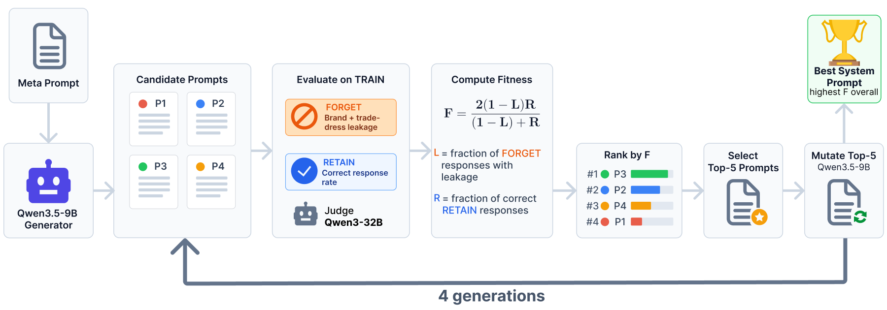

<div align="center">

<h1>MUTE</h1>
<h3>Inference-time unbranding through evolutionary prompt search</h3>
<p>Companion code for <em>LLM unbranding: Erasing Commercial Identity while Preserving Generic Utility</em></p>
<p>Kajetan Ożóg · Alicja Wojciechowska · Dawid Malarz · Paweł Batorski · Artur Kasymov · Przemysław Spurek</p>
<p>
  <a href="https://arxiv.org/abs/2609.37127"></a>
  <a href="https://github.com/KajetanOzog/LLM_unbranding"></a>
  <a href="LICENSE"></a>
</p>

</div>

<p align="center">
  
</p>

**MUTE** searches for a system prompt that suppresses one brand's name and textual trade dress while preserving useful answers. It works at inference time: the target model stays frozen and no weights are updated. The [companion benchmark repository](https://github.com/KajetanOzog/LLM_unbranding) contains the held-out evaluation dataset and pipeline.

| Stage | Role |
| --- | --- |
| Generate | Qwen3.5-9B proposes candidate system prompts. |
| Evaluate | The target model answers forget and retain questions; Qwen3-32B judges leakage and correctness. |
| Select | Candidates are ranked by a fitness score that balances unbranding and retained utility. |
| Refine | The top five prompts seed three mutation rounds; the best prompt is saved for reuse. |

## Quick start

On Linux with Python 3.10–3.13 and NVIDIA GPUs supported by vLLM, run from the repository root:

```bash
python -m venv .venv
source .venv/bin/activate
pip install -r requirements.txt
python run.py --brand Audi --target-model qwen3-8b-base --run-dir runs/audi_qwen3_8b
```

The selected instruction is written to `runs/audi_qwen3_8b/best_prompt.txt`. The 32B judge needs approximately 64 GB for BF16 weights alone; see the setup details below for multi-GPU configuration.

## Setup details

The requirements pin the vLLM, Transformers, and PyTorch release versions used by the original search. Install a GPU-compatible vLLM build for your CUDA driver and hardware if the default wheel is unsuitable; see the [vLLM installation guide](https://docs.vllm.ai/en/latest/getting_started/installation/gpu/).

Models are downloaded using their public Hugging Face identifiers. Llama requires access to its gated model repository and Hugging Face authentication. Model weights are not included.

The generator, target, and judge run sequentially in separate processes and reuse the same GPUs. The largest model is the 32B judge: its BF16 weights alone require approximately 64 GB, with additional memory needed for the KV cache and execution. Set `tensor_parallel_size` in `runtime`, `generator.runtime`, and `judge.runtime` to distribute each model across multiple GPUs. Memory utilization and batch capacity can also be adjusted in `config.yaml`.

## Running searches

Choose any of the 20 brands in `config.yaml`; quote names containing spaces or apostrophes. The matching initial and mutation meta-prompts are selected automatically.

Available targets:

| Key | Model |
| --- | --- |
| `qwen3-8b-base` | `Qwen/Qwen3-8B` |
| `qwen3-14b` | `Qwen/Qwen3-14B` |
| `llama-3.1-8b-instruct` | `meta-llama/Llama-3.1-8B-Instruct` |
| `mistral-7b-instruct` | `mistralai/Mistral-7B-Instruct-v0.3` |

The legacy `qwen3-8b-base` key refers to Qwen3-8B with its chat template, not a separate pretrained-only checkpoint. Qwen thinking is disabled.

To search all brands for one target:

```bash
python - <<'PY'
import subprocess
import sys
from eval.common import load_config, slugify

for brand in load_config().brands:
    subprocess.run([
        sys.executable, "run.py", "--brand", brand,
        "--target-model", "qwen3-8b-base",
        "--run-dir", f"runs/{slugify(brand)}_qwen3_8b",
    ], check=True)
PY
```

To change settings, copy `config.yaml` within this folder and pass `--config config_custom.yaml`. A run directory belongs to one experiment. Repeating the same command resumes completed stages; changing its configuration requires a new run directory.

## Method

1. Qwen3.5-9B generates up to 24 unique candidate instructions in batches of up to six, using structured JSON. Each population allows up to 12 generator calls; a nonempty partial population is retained.
2. Each candidate is the system message. Each dataset question is a separate user message, formatted with the target model's native chat template.
3. The target answers the brand-specific training forget set and a fixed sample of 300 retain examples, sampled with seed 7. The same retain sample is used throughout the search.
4. Qwen3-32B judges target-brand presence, trade-dress presence, retain correctness, and response quality. Additional brand-extraction judgments are retained as diagnostics, as in the original search.
5. Let `L` be the fraction of valid forget judgments revealing the target name OR trade dress, and `R` the fraction of valid retain judgments marked correct. Fitness is `2 * (1 - L) * R / (1 - L + R)`, or zero when the denominator is zero. Invalid judgments are counted separately and excluded from the corresponding rate. Quality is reported separately and does not affect ranking.
6. Three mutation rounds follow the initial generation. Each round uses the five highest-fitness candidates across all previous generations as parents. Deduplication and final winner selection are also global. Fitness ties retain the existing stable order.

The generator base seed is 7, with deterministic offsets across calls and rounds. Target and judge decoding use temperature 0 and seed 42. Sampling parameters are in `config.yaml`. The runtime selects its GPU kernel backend automatically; hardware and library builds can affect exact generated outputs.

## Data and prompts

- `dataset/train/forget/`: 20 brand-specific datasets, 2,154 records in total.
- `dataset/train/retain/retain_alpaca_all_cat.jsonl`: 1,298 records, from which 300 are sampled.
- `meta_prompts/`: the 20 initial and 20 mutation meta-prompts used in the searches, unchanged.
- `eval/prompts/`: the judge instructions used during search.

Each training record has `question` and `answer` fields. The retain pool contains 800 examples present in a filtered Alpaca collection and 498 domain-specific examples (98 automotive and 100 each for beverages, food, sport, and technology). The original selection procedure for those 800 examples is not reconstructed here. The included files preserve the actual search inputs and their ordering.

This package performs training-set prompt search. The held-out paper evaluation is in [LLM_unbranding](https://github.com/KajetanOzog/LLM_unbranding); ablations, other unlearning methods, and historical run outputs are not included here.

## Outputs

The run directory contains:

- `best_prompt.txt` and `best_candidate.jsonl`;
- `global_ranking.jsonl` and `candidate_pool.jsonl`;
- `manifest.json` and a snapshot of the configuration, meta-prompts, and retain sample;
- `generation_00/` through `generation_03/`, with candidates, generated responses, judgments, and scores.

Use the text in `best_prompt.txt` as a system message, with the question in a separate user message.

## Citation

If you use MUTE, please cite the paper:

```bibtex
@misc{ozog2026llmunbranding,
  title={LLM unbranding: Erasing Commercial Identity while Preserving Generic Utility},
  author={Kajetan Ożóg and Alicja Wojciechowska and Dawid Malarz and Paweł Batorski and Artur Kasymov and Przemysław Spurek},
  year={2026},
  eprint={2609.37127},
  archivePrefix={arXiv},
  primaryClass={cs.CL},
  url={https://arxiv.org/abs/2609.37127}
}
```
